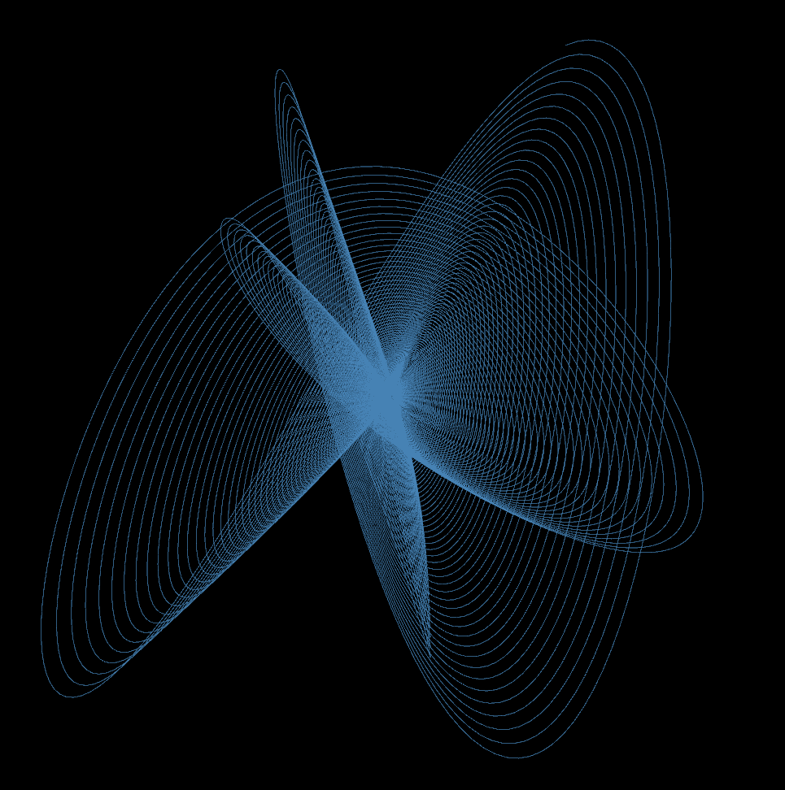
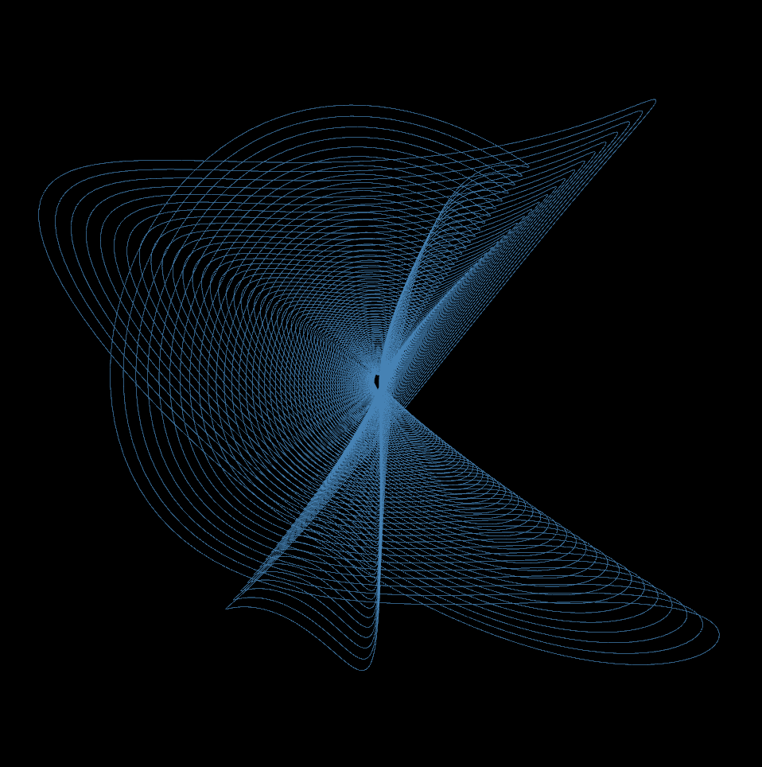
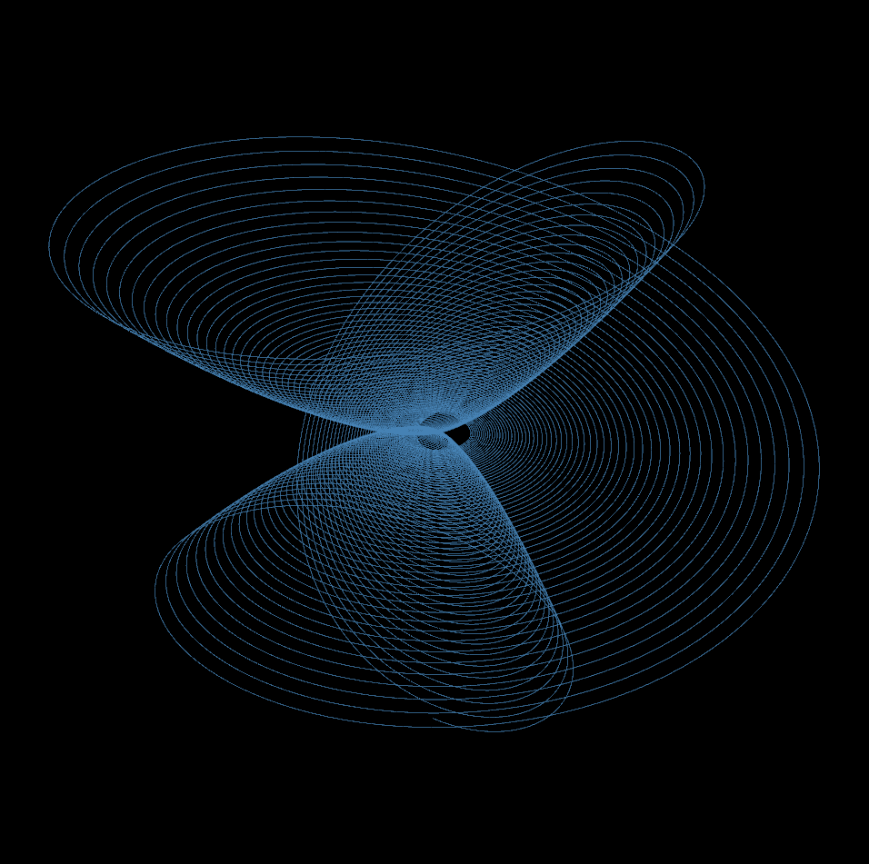
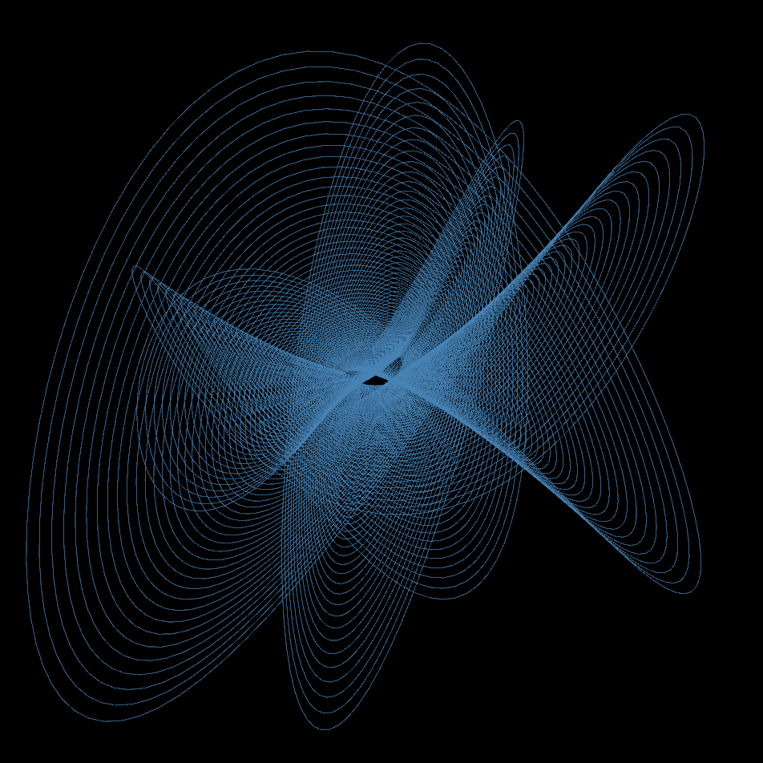
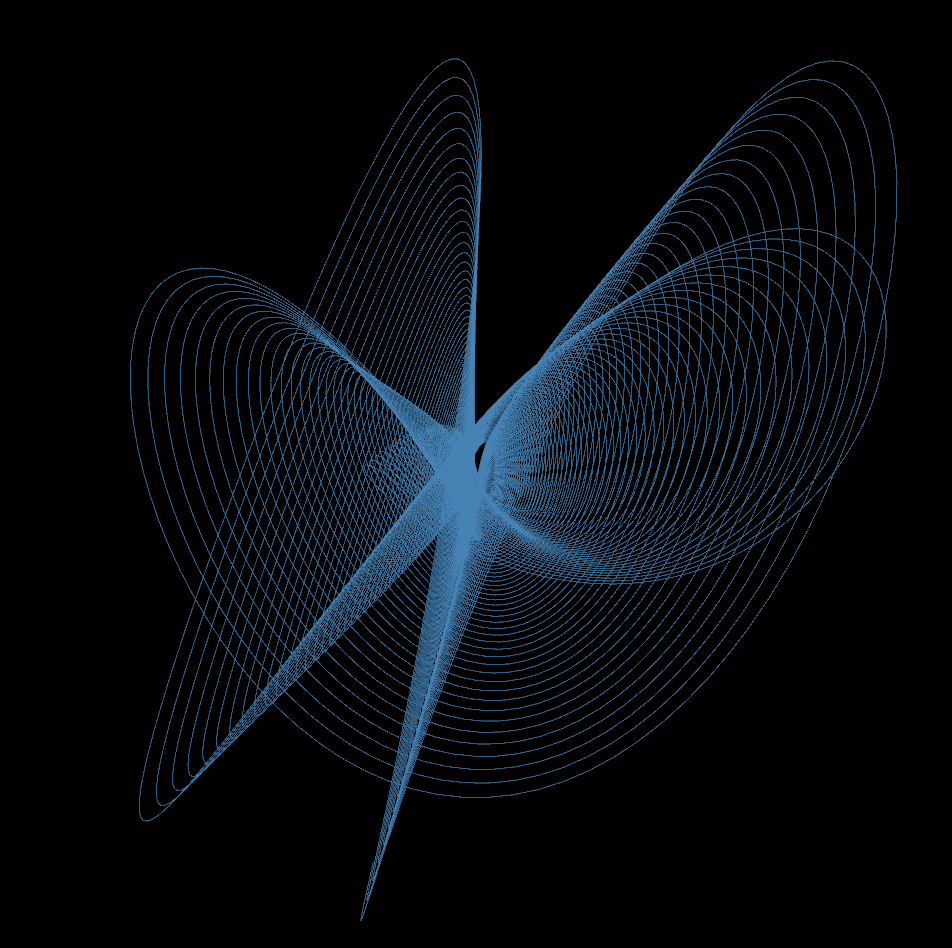

# Harmonograph Generation
What is this?

This is a program that draws Lissajous curves. 

## What is a harmonograph?
A harmonograph as defined by wikipedia is a mechanical apparatus that employs pendulums to create a geometric image.

This particular harmonograph program was inspired by a swinging table harmonograph which is based on a large slab table swining off wires and a static pen drawing the curves.

## Output Examples

